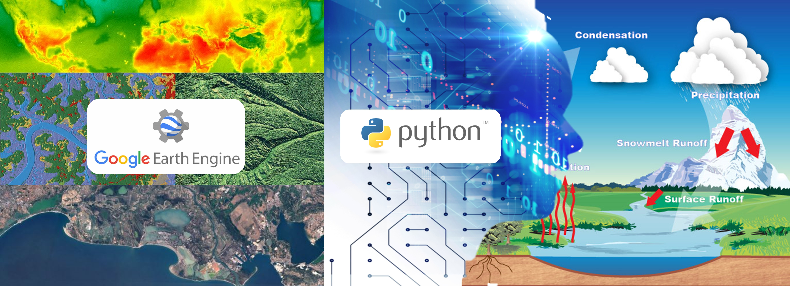

# Getting Started: Virtual Environment
It is a best practice to create a virtual environment when starting a new project, as a virtual environment essentially creates an isolated working copy of Python for a particular project. 
I.e., each environment can have its own dependencies or even its own Python versions.
Creating a Python virtual environment is useful if you need different versions of Python or packages for different projects.
Lastly, a virtual environment keeps things tidy, makes sure your main Python installation stays healthy, and supports reproducible and open science.

## Creating your Python-GEE Virtual Environment
Since we will be using Jupyter Notebooks for this exercise, we will use the Anaconda command prompt to create our vitual environment. 
In the command line type: 

For this example, we will be using Python version 3.9.12, specify this version when setting up your new virtual environment.
After Anaconda finished setting up your GEE_env, activate it using the activate function.

You should now be working in your new GEE_env within the command prompt. 
However, we will want to work in this environment within our Jupyter Notebook and need to create a kernel to connect them.
We begin by installing the **ipykernel** python package:

With the package installed, we can connect the GEE_env to our Python Notebook

Open up the [GEE_Workshop_CH1.ipynb](./GEE_Workshop_CH1.ipynb) file, click the kernal tab on the top toolbar, and select the GEE_env. 
The GEE_env should show up on the top right of the Jupyter Notebook.

## Loading the required packages
Python uses packages to support data science tasks, and to ensure the packages work nicely together, is one reason we created our GEE_env.
There are many ways to install package in your new Python environment and we will be installing them through the command prompt.
Since the primary package is Earth Engine, we will be installing this package first and use the conda.
We use conda vs. pip install, **Conda** is a cross platform package and environment manager that installs and manages conda packages from the Anaconda repository as well as from the Anaconda Cloud.
Conda packages are binaries and there is never a need to have compilers available to install them. 
**Pip** is the Python Packaging Authority’s recommended tool for installing packages from the Python Package Index, PyPI. 
Pip installs Python software packaged as wheels or source distributions, and may require that the system have compatible compilers, and possibly libraries, installed before invoking pip to succeed.
Type the below code into your Anaconda Command Prompt.

Enter y when requested.
Now that you have the Earth Engine package installed in your GEE_env, we need to connect it to your GCloud and authenticate.

Running this code block will open a browser window and require your approval to access Earth Engine. 
After completion, lets see if we were successful in connecting our GEE_env to Google Earth Engine.

    python
    import ee

    # Initialize the Earth Engine module.
    ee.Initialize()

    # Print metadata for a DEM dataset.
    print(ee.Image('USGS/SRTMGL1_003').getInfo())

You should see the metadata for this dataset printed in the prompt.

